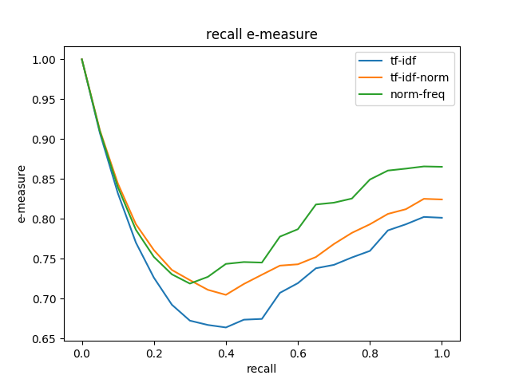

# Friweb

* Authors: Ghislain Jeanneau, Jules Denardou
* Technology: Python3

## Indexing

### Question 1

The number of tokens can be obtained by summing how many times a word occurs in each document.

For the CACM collection, it is **105702**
For the CS278 collection, it is **15 983 210**

### Question 2

We get the size of the vocabulary by checking out the length of the inverted index we have built.

For the CACM collection, it is **15565**
For the CS278 collection, it is **244 561**

### Question 3

For half of the corpus we have:

On CACM: vocabulary size of **10255** and **54489** tokens.

 - Thus we obtain for the Heap Law: **k = 9,917**, **b = 0,636**
    
On CS278: vocabulary size of **151 350** and **7 582 480** tokens

 - Thus we obtain for the Heap Law: **k = 5,689**, **b = 0,643**

### Question 4

With the values obtained with the CACM collection, for a million token, we end up with a vocabulary size of **64 920**
With the values obtained with the CS@76 collection, for a million token, we end up with a vocabulary size of **41 023**

## Performance

Performance can be tested running `python3 performance_test.py`

### Recall precision curve

### E-measure curve

### F-measure curve

### R-measure

tf-idf | tf-idf-norm | norm-freq
:-----:|:-----------:|:--------:
0.392  | 0.332       | 0.313

### MAP

tf-idf | tf-idf-norm | norm-freq
:-----:|:-----------:|:--------:
0.351  | 0.257       | 0.261
